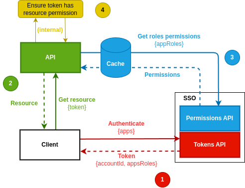

# EverRest RBAC API

## How RBAC authorization works

1. Client first need to obtain an access token by authenticating through SSO API. Clients should provide a list of applications the token may be used for in order for SSO to include the list of user roles for those apps in token payload.

2. Client use the token to query resource from an API endpoint.
3. API decode the list of user roles from token payload, then make an API call to get permissions associated to this role.
4. API then uses those permissions to determine whether access to requested endpoint should be authorized or rejected.



*Illustration: Applications authorization flow using EverRest SSO*

## Automatic setup feature of SDK

### Motivation
Instead of manually managing permissions for our API, and eventually forgetting some, an SDK allows automatic declaration of permissions used in API. At API startup, it will automatically call SSO permissions API to register permissions for current API version.

If a permission that was previously registered is not provided while declaring permissions for API version `X.Y.Z`, it must be marked as deprecated in SSO database by setting permission field `deprecated_since` to current version identifier `X.Y.Z`.

An endpoint should allow listing deprecated permissions.

### Example interface
```python
app = FastAPI()
sso = EverRestSDK(app_name="junkquit", app_version="X.Y.Z")

@app.get("/recipes/{recipeId}")
async def get_recipe(
    recipe_id: str = Path(alias="recipeId"),
    is_admin: bool = sso.has_permission(
        code="recipes:read",
        description="Read private recipes without being owner."
    )
):
    if not is_admin and not is_recipe_owner(current_user):
        raise HTTPException(403, detail="Access forbidden")


@app.get("/users/{userId}/contact", dependencies=[
    sso.requires_permission(
        code="users:contact",
        description="Get user contact informations"
    )
])
async def get_user_contact_details():
    ...

@asynccontextmanager
async def lifespan(app: FastAPI):
    await sso.declare_permissions()
```

## Roles API endpoints

### Declare a global role

**Endpoint**

```
POST /v1/roles
```

**Payload**

```json
{
  "name": "Admin",
  "description": "Administrative role that grants all permissions on all applications."
}
```

**Output**

```json
{
  "id": "f2910c934c594ed189b8f84ce6ab1a7d",
  "name": "Admin",
  "description": "Administrative role that grants all permissions on all applications."
}
```

### Declare an application role

**Endpoint**

```
POST /v1/app/{appId}/roles
```

**Payload**

```json
{
  "name": "Ingredients manager",
  "description": "Allow managing ingredients available to all users."
}
```

**Output**

```json
{
  "id": "7f296069866746b4acdd84e740262314",
  "name": "Ingredients manager",
  "description": "Allow managing ingredients available to all users.",
  "app": "junkquit"
}
```

### List global roles

**Endpoint**

```
GET /v1/roles
```

**Output**

```json
[
  {
    "id": "f2910c934c594ed189b8f84ce6ab1a7d",
    "name": "Admin",
    "description": "Administrative role that grants all permissions on all applications."
  },
  {
    "id": "7f296069866746b4acdd84e740262314",
    "name": "Ingredients manager",
    "description": "Allow managing ingredients available to all users.",
    "app": "junkquit"
  }
]
```

### List application roles

**Endpoint**

```
GET /v1/app/{appId}/roles
```

**Output**

```json
[
  {
    "id": "7f296069866746b4acdd84e740262314",
    "name": "Ingredients manager",
    "description": "Allow managing ingredients available to all users.",
    "app": "junkquit"
  }
]
```

### List user roles

**Endpoint**

```
GET /v1/users/{userId}/roles
```

**Output**

```json
[
  {
    "id": "f2910c934c594ed189b8f84ce6ab1a7d",
    "name": "Admin",
    "description": "Administrative role that grants all permissions on all applications."
  },
  {
    "id": "7f296069866746b4acdd84e740262314",
    "name": "Ingredients manager",
    "description": "Allow managing ingredients available to all users.",
    "application": "junkquit"
  }
]
```

### Assign role to a user

**Endpoint**

```
POST /v1/users/{userId}/roles/assign/{roleId}
```

### Revoke a user's role

```
POST /v1/users/{userId}/roles/revoke/{roleId}
```

## Permissions API endpoints

### Declare application permissions

**Endpoint**

```
POST /v1/app/{appId}/{appVersion}/permissions/batch
```

**Payload**

```json
[
  {
    "code": "recipes:read",
    "description": "Read private recipes without being owner."
  },
  {
    "code": "users:contact",
    "description": "Get user contact informations."
  }
]
```

### List application permissions


**Endpoint**

```
POST /v1/permissions?app={appId}&version={appVersion}
```

**Payload**

```json
[
  {
    "app": "junkquit",
    "version": "X.Y.Z",
    "code": "recipes:read",
    "description": "Read private recipes without being owner."
  },
  {
    "app": "junkquit",
    "version": "X.Y.Z",
    "code": "users:contact",
    "description": "Get user contact informations."
  }
]
```

### Grant permissions to a role

**Endpoint**

```
POST /v1/roles/{roleId}/permissions/grant
```

**Payload**

```json
{
    "permissions": ["recipes:read"]
}
```

### Revoke permission for a role


**Endpoint**

```
POST /v1/roles/{roleId}/permissions/revoke
```

**Payload**

```json
{
    "permissions": ["recipes:read"]
}
```

### List permissions for a role


**Endpoint**

```
GET /v1/roles/{roleId}/permissions?apps=junkquit,sso
```

**Output**

```json
[
  {
    "app": "junkquit",
    "version": "X.Y.Z",
    "code": "recipes:read",
    "description": "Read private recipes without being owner."
  },
  {
    "app": "junkquit",
    "version": "X.Y.Z",
    "code": "users:contact",
    "description": "Get user contact informations."
  }
]
```
